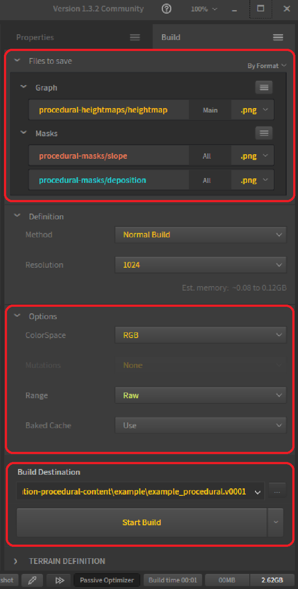

# Workflow Integration for Procedural Software

This repository provides a script to enhance the workflow between procedural software and a map editor for the game Supreme Commander: Forged Alliance. The script assists the user in converting the output of procedurally generated content into a format acceptable by the map editor. This effectively eliminates the need for tools such as Photoshop or Gimp that are usually used to manually convert files into the correct format.

## Software Requirements

- [Bash interpreter](https://git-scm.com/downloads): This tool allows running the conversion script. Any recent version will suffice.
- [ImageMagick](https://imagemagick.org/): This tool performs all the heavy lifting. It provides a command line interface that we can use to convert the textures into the correct format. The conversion script is developed using the Windows binary release version ImageMagick-7.1.1-24-Q16-HDRI-x64-dll.exe.
- [FAForever map editor](https://github.com/FAForever/FAForeverMapEditor): This tool allows manipulating the Supreme Commander: Forged Alliance map binary. We can import the output of the conversion script and immediately view the result.

## Intended Workflow

Instead of one map, you'll work with two different maps. The first map is the 'input' map for the procedural software. The second map is the 'output' map that represents the map you can publish. Both the input and the output maps have a specific file hierarchy.

### File Hierarchy of the Input Map

- Any folder that starts with `input` can be used for input to the procedural software. The content of these folders is included by Git but ignored by the conversion script.
- Any folder that starts with `convert` can be used as input for the map. The content of these folders is included by Git and is converted by the conversion script.
- Any folder that starts with `procedural` can be used as input for the map. The content of these folders is ignored by Git, but it is converted by the conversion script.
- The `procedural` folder can be used for intermediate results of the procedural software. It will be ignored by both Git and the conversion script.

### File Hierarchy of the Output Map

- The `heightmaps` folder contains the output of `convert-heightmaps` and `procedural-heightmaps`. The content is ignored by Git.
- The `masks` folder contains the output of `convert-masks` and `procedural-masks`. The content is ignored by Git.
- The `env/layers` folder contains the output of `convert-strata` and `procedural-strata`. The content is included by Git.
- The `env/decals` folder contains the output of `convert-decals` and `procedural-decals`. The content is included by Git.

Before publishing the map, it is recommended to remove the heightmaps and masks folder as they serve no purpose other than pushing around bandwidth.

## Adapting the Workflow

There are three parameters at the top of the script file:

- `target`: The name of the output map. The path is relative (note the `../`). Requires a trailing `/`. You need to update this reference when you bump the version of the map.
- `resolutionMask`: The resolution of the mask. This is usually 256 for a 5x5 map, 512 for a 10x10 map, and 1024 for a 20x20 map.
- `resolutionHeightmap`: The resolution of the heightmap. This is 257 for a 5x5 map, 513 for a 10x10 map, and 1025 for a 20x20 map.

## Running the Workflow

If you have a Bash interpreter installed, then running the workflow is as simple as starting the conversion script as you would start any other executable.

## Suggestions

Use the `png` format for all your output. The encoding reduces the file size, and it doesn't reduce the image quality.

### For Gaea

In the `Build Manager` and specifically the `Files to save` section:

- Only export the main output of a node unless you specifically need the secondary (unprocessed) secondary outputs.
- You can map outputs to a specific folder by introducing a `/`, as an example: `procedural-heightmaps/heightmap`.

In the `Build Manager` and specifically the `Options` section:

- Use `RGB` as your color space. Other color spaces may confuse Image Magick.
- Use `Raw` as your range. Other ranges produce different results from what you see in Gaea.

In the `Build Manager`, you should use the input map folder (`example_procedural.v0001`) as your output.

### For World Machine

There are no specific suggestions for World Machine. The script was originally designed for World Machine.

## FAQ

### The editor does not automatically update the decals when I change decals

The editor does not make use of the [FileSystemWatcher class](https://learn.microsoft.com/en-us/dotnet/api/system.io.filesystemwatcher?view=net-8.0). If you're interested in implementing that, then do get in touch with us through [Discord](https://discord.gg/mXahVSKGVb) or by opening an issue or pull request at [FAForever map editor](https://github.com/FAForever/FAForeverMapEditor).

### The script does not work out of the box!

Make sure you have ImageMagick installed. Then make sure that you have read and applied the 'Adapting the Workflow' section. The script does not work out of the box - it can't possibly know the name of your map, for example. If you need further assistance, then do get in touch with us through [Discord](https://discord.gg/mXahVSKGVb) and specifically the mapping-general channel. You'll need to give yourself the mapper role in the 'Channels & Roles' page to see the map-specific channels.